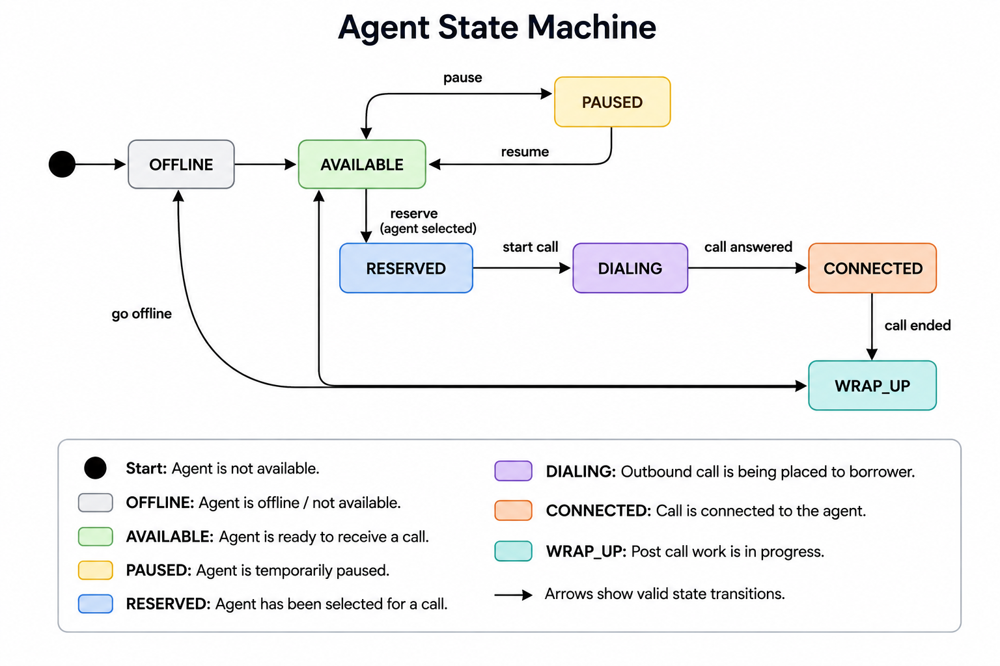
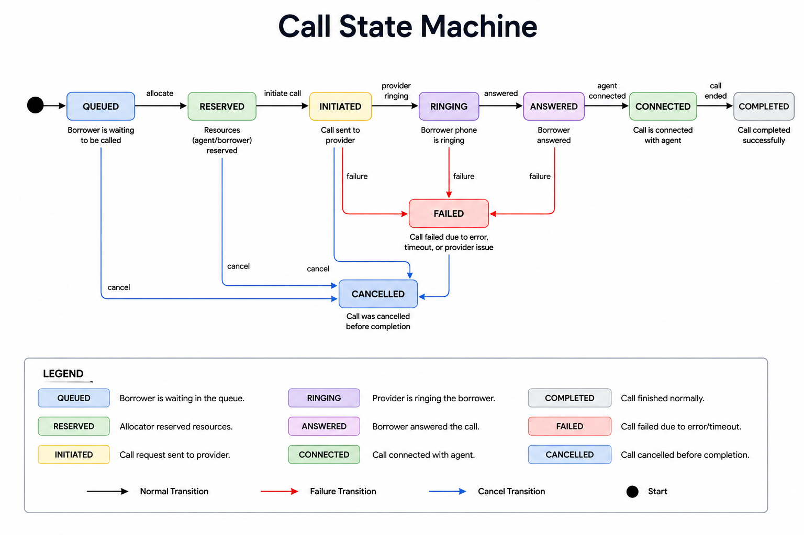

# SmartDialer Architecture

## 1. Overview

SmartDialer is a small, runnable prototype for a collections use case.

The system supports two dialing strategies:

- Progressive dialing
- Predictive dialing

The key architectural rule is:

> The predictive pacing engine can suggest how many calls should be started, but it cannot directly place a telecom call.

The mandatory flow is:

```text
Campaign
   ↓
Pacing Engine (Progressive / Predictive)
   ↓
Safety Controller
   ↓
Call Allocator
   ↓
Telecom Provider
```

## 2. Architecture


### Component Responsibilities

#### Campaign

Contains campaign-level configuration:

- Target borrowers
- Answer-rate model
- Talk-time model
- Safety settings
- Provider settings

The campaign does not directly place calls.

#### Pacing Engine

The pacing engine decides how many calls it would like to start.

It has two implementations:

- `ProgressivePacer`
- `PredictivePacer`

The pacing engine only produces a pacing suggestion. It cannot call the telecom provider directly.

#### Safety Controller

The Safety Controller is the mandatory safety boundary. It receives a pacing suggestion and decides whether to `APPROVE`, `REDUCE`, `REJECT`, or `FALLBACK`.

It considers:

- Available agent capacity
- Reserved capacity
- In-flight calls
- Connected calls
- Provider health
- Safety buffer
- Predictive capacity tokens

The predictive algorithm cannot bypass this controller.

#### Call Allocator

The Call Allocator:

1. Selects a borrower.
2. Selects an agent when required.
3. Reserves resources.
4. Creates the call.
5. Invokes the telecom provider.
6. Processes provider events.
7. Releases resources when the call finishes or fails.

#### Telecom Provider

The application uses a provider interface so the dialer does not depend on provider-specific behavior.

Two mock providers are implemented:

- Provider A — fast and reliable.
- Provider B — slower and unreliable.

Provider B can simulate timeouts, duplicate events, out-of-order events, and provider failures.

## 3. Main Request Flow

```text
Campaign
   |
   v
Pacing Engine
   |
   | suggestion: N calls
   v
Safety Controller
   |
   | APPROVE / REDUCE / REJECT / FALLBACK
   v
Call Allocator
   |
   +----> Borrower
   |
   +----> Agent
   |
   v
Telecom Provider
```

The Pacing Engine cannot directly invoke the Telecom Provider. Only the Call Allocator invokes the provider after the Safety Controller has approved the requested capacity.

## 4. Progressive Dialing

Progressive dialing follows:

```text
1 available agent
       |
       v
1 outbound call
```

If there are 50 available agents, the progressive dialer does not create more than 50 agent-bound calls.

The normal sequence is:

```text
AVAILABLE → RESERVED → DIALING → CONNECTED → WRAP_UP → AVAILABLE
```

If call setup fails, the agent reservation is released and the agent returns to `AVAILABLE`.

## 5. Predictive Dialing

Predictive dialing attempts to improve agent utilization by starting calls before an agent becomes free.

The predictive pacer considers:

- Current agent availability
- Calls already in progress
- Historical answer rate
- Average call duration
- Provider health
- Recent campaign behavior

A simplified calculation is:

```text
expected_calls_per_agent = 1 / answer_rate
```

The result is adjusted using safety limits and provider health. The predictive pacer can suggest additional calls, but the final decision belongs to the Safety Controller.

## 6. Safety Controller

```text
Predictive Pacer
      |
      | "I want N calls"
      v
Safety Controller
      |
      +---- capacity check
      +---- provider health check
      +---- in-flight call check
      +---- safety buffer
      |
      v
APPROVE / REDUCE / REJECT / FALLBACK
```

The predictive model is allowed to be wrong; the safety boundary is not.

### Safety invariant

> A predictive call cannot enter `ANSWERED` or `CONNECTED` unless an agent has been atomically reserved for it.

The answer-time safety gate is required because agent availability can change after pacing approval. If a predictive call answers and no agent can be reserved, the worker cancels the call instead of recording an abandoned connected call.

## 7. Predictive Capacity Ledger

Predictive calls use capacity tokens. A predictive approval consumes a capacity token, while terminal completion, failure, or cancellation releases it.

```text
Available safety capacity
        |
        v
Capacity Ledger
        |
        +---- Worker 1
        +---- Worker 2
        +---- Worker N
```

The ledger is shared so concurrent workers cannot independently approve the same capacity.

## 8. Agent State Machine



The agent lifecycle is:

```text
OFFLINE → AVAILABLE → RESERVED → DIALING → CONNECTED → WRAP_UP → AVAILABLE
```

An agent can also move between `AVAILABLE` and `PAUSED`, and from `AVAILABLE` or `PAUSED` to `OFFLINE`.

| State | Meaning |
|---|---|
| `OFFLINE` | Agent is offline / not available |
| `AVAILABLE` | Agent is ready to receive a call |
| `RESERVED` | Agent has been selected for a call |
| `DIALING` | Outbound call is being established |
| `CONNECTED` | Agent is handling a connected borrower |
| `WRAP_UP` | Post-call work is in progress |
| `PAUSED` | Agent is temporarily unavailable |

## 9. Call State Machine



The normal call lifecycle is:

```text
QUEUED → RESERVED → INITIATED → RINGING → ANSWERED → CONNECTED → COMPLETED
```

Failure and cancellation paths are also supported.

| State | Meaning |
|---|---|
| `QUEUED` | Borrower is waiting to be called |
| `RESERVED` | Required resources have been reserved |
| `INITIATED` | Call request was sent to provider |
| `RINGING` | Borrower phone is ringing |
| `ANSWERED` | Borrower answered |
| `CONNECTED` | Call is connected with an agent |
| `COMPLETED` | Call ended normally |
| `FAILED` | Call failed or timed out |
| `CANCELLED` | Call was cancelled |

## 10. Concurrency

Multiple workers may attempt to allocate the same agent simultaneously.

Only one worker may successfully perform:

```text
AVAILABLE → RESERVED
```

The prototype uses locking and a state re-check:

```text
Acquire lock
    |
    v
Check agent == AVAILABLE
    |
    v
Change to RESERVED
    |
    v
Release lock
```

For a multi-process or multi-machine deployment, an in-memory lock is not sufficient. A production implementation would use durable shared state such as PostgreSQL row-level locking or an equivalent distributed lease.

## 11. Borrower Allocation

Borrowers must also be protected from duplicate allocation.

Workers must atomically claim borrowers so multiple workers do not create duplicate active calls for the same borrower.

## 12. Duplicate Provider Events

External providers cannot be assumed to behave perfectly.

Example:

```text
ANSWERED
ANSWERED
ANSWERED
COMPLETED
```

Provider events are idempotent by event identifier. Repeated events do not create duplicate logical state transitions.

## 13. Out-of-Order Provider Events

Providers may send events out of order, for example:

```text
COMPLETED
ANSWERED
RINGING
```

The call state machine uses state ordering so stale lower-ranked events cannot move a call backwards.

```text
QUEUED < RESERVED < INITIATED < RINGING < ANSWERED < CONNECTED < COMPLETED
```

The implementation also handles a provider reporting `CONNECTED` before `ANSWERED`; the answer-time agent reservation requirement must still be satisfied before the call is treated as safely connected.

## 14. Worker Crash Recovery

Consider:

```text
Agent reserved
      ↓
Borrower reserved
      ↓
Call initiated
      ↓
Worker crashes
```

Agent and borrower reservations carry lease information. A reconciliation process detects stale reservations and releases or reconciles them.

The system reconciles agent state, borrower state, call state, and capacity tokens.

Calls that were initiated but never produce an expected provider event are recovered by the call setup timeout.

## 15. Provider Timeout

A provider may accept a request but fail to produce an expected event.

```text
INITIATED / RINGING
        |
        | timeout
        v
      FAILED
        |
        v
release resources
        |
        v
retry if allowed
```

Retries are bounded. Before retrying, agent reservations and capacity tokens are released and the borrower is returned to `PENDING` when appropriate.

## 16. Provider Outage

When provider health deteriorates:

```text
Provider health
      |
      v
Safety Controller
      |
      +---- reduce new calls
      +---- reject new calls
      +---- fallback to progressive
```

Existing calls are allowed to finish where possible. New calls are reduced or stopped depending on provider health. Retries are bounded so an outage does not create a retry storm.

## 17. Provider A

Provider A represents a healthy provider:

- Fast
- Reliable
- Low failure rate
- Normal event ordering

## 18. Provider B

Provider B represents an unreliable provider and can simulate:

- Higher latency
- Timeouts
- Duplicate events
- Out-of-order events
- Provider failures

The dialer interacts with Provider B through the common provider interface.

## 19. Retry Strategy

Retries are bounded:

```text
FAILED
  |
  v
retry_count < max_retries?
  |
  +---- NO ----> terminal failure
  |
  +---- YES ---> release resources
                    |
                    v
                  PENDING
                    |
                    v
                  retry
```

A production system should also use exponential backoff and provider-health feedback.

## 20. Scenario Simulation

The simulator evaluates the assignment scenarios:

| Scenario | Answer rate | Average talk time |
|---|---:|---:|
| A | 20% | 120 seconds |
| B | 50% | 90 seconds |
| C | 70% | 180 seconds |
| D | Changing | Changing |

The laptop simulation scales talk time down while preserving the relative A/B/C relationships. Scenario D changes both answer rate and talk time during the run.

The simulator reports calls initiated, connected, completed, failed, abandoned, average agent utilization, and Safety Controller decisions.

## 21. Load Testing

The prototype includes a reservation load test for:

```text
100 agents
1,000 agents
10,000 agents
```

The prototype deliberately uses a linear in-memory scan. This is acceptable for demonstrating the algorithm, while production indexing/database changes would remove this bottleneck.

## 22. Scaling

### 100 agents

A single process with the in-memory prototype can be sufficient. The main concern is correctness.

### 1,000 agents

Increase workers and move important shared state toward durable storage. Potential bottlenecks include agent allocation, borrower allocation, event processing, and provider throughput.

### 10,000 agents

A single shared lock or single database transaction path can become a bottleneck. Partition work by campaign or agent groups and distribute provider calls and event processing.

### Larger scale

At larger scale:

- Partition campaigns
- Partition agents
- Partition borrowers
- Partition event processing
- Use durable queues
- Use database partitioning where required
- Maintain distributed capacity accounting
- Isolate provider integrations

Workers can scale horizontally without weakening the Safety Controller.

## 23. Observability

Important metrics include:

```text
agent_available
agent_reserved
agent_connected

calls_queued
calls_initiated
calls_ringing
calls_connected
calls_completed
calls_failed
calls_abandoned

provider_latency
provider_failure_rate

pacing_requested
pacing_approved
pacing_reduced
pacing_rejected

retry_count
stale_reservations
```

Logs should include worker ID, agent ID, borrower ID, call ID, provider event ID, state transition, and safety decision.

## 24. Idempotency

Idempotency is required because workers and providers can repeat work.

The system uses identifiers such as:

```text
call_id
event_id
worker_id
```

A provider event is processed once logically even if it is delivered multiple times.

## 25. Important Invariants

### Agent invariant

> An agent can be reserved by at most one active call.

### Borrower invariant

> A borrower cannot have multiple active outbound calls.

### Safety invariant

> Predictive pacing cannot bypass the Safety Controller.

### Provider invariant

> Provider-specific behavior is hidden behind the provider interface.

### Event invariant

> Duplicate events do not create duplicate state transitions.

### State invariant

> Terminal call states cannot be moved backwards by stale events.

### Recovery invariant

> Worker failure must not permanently leak reservations.

### Answer-time safety invariant

> A call cannot become safely `CONNECTED` without an agent reservation.

## 26. Architecture Decisions

### Why Python?

Python was selected because this is a small functional prototype and Python allows the concurrency, state-machine, simulation, and testing logic to be implemented clearly with minimal infrastructure.

### Why asyncio?

The prototype contains simulated I/O-style operations and provider events. `asyncio` allows multiple simulated workers to execute concurrently without introducing unnecessary infrastructure.

### Why no Kafka/Redis?

The assignment does not require Kafka, Redis, or microservices. For the prototype, in-process structures are enough to demonstrate the core logic.

A production deployment would move critical shared state and leases into durable shared infrastructure.

### What does the simple design make harder?

The prototype does not provide true distributed durability across multiple machines. In production, agent reservations, borrower reservations, the capacity ledger, event deduplication, and worker leases would need durable implementations.

## 27. Failure Handling Summary

| Failure | Expected behavior |
|---|---|
| Worker crash | Expired leases are reconciled |
| Provider timeout | Call times out and resources are released |
| Provider outage | New dialing is reduced/rejected |
| Duplicate event | Event is ignored after first processing |
| Out-of-order event | Invalid backward transition is ignored |
| Agent availability drop | Capacity is recalculated |
| Call failure | Resources are released and retry is bounded |
| High answer rate | Safety Controller limits capacity |
| Low answer rate | Predictive pacing reduces unnecessary dialing |

## 28. Assignment Coverage

This prototype covers the requested assignment areas:

- Working source code
- README and local setup instructions
- Architecture diagram
- Agent state machine
- Call state machine
- Progressive Dialer
- Predictive Pacing Engine
- Safety Controller
- Mock telecom Provider A
- Mock telecom Provider B
- Concurrency protection
- Borrower allocation
- Duplicate event handling
- Out-of-order event handling
- Worker crash recovery
- Provider outage handling
- Provider timeout handling
- Retry handling
- Agent availability changes
- Scenarios A/B/C/D
- Basic simulation
- Basic load test
- Architecture decision documentation
- Automated tests

## 29. Final Design Principle

```text
Predictive intelligence
        +
Deterministic safety boundary
        =
Safe utilization improvement
```

The predictive engine is allowed to estimate. The Safety Controller is responsible for enforcing.

```text
Predictive Pacer
      |
      | suggestion
      v
Safety Controller
      |
      | approved capacity
      v
Call Allocator
      |
      v
Telecom Provider
```

The predictive model can be changed, improved, or replaced without giving it the ability to bypass the safety boundary.

## 30. Final Answer

I would build the SmartDialer as a hybrid system where predictive pacing is used to improve utilization, but every pacing decision passes through a deterministic Safety Controller.

Progressive dialing provides the baseline safe behavior:

```text
one available agent → one outbound call
```

Predictive pacing estimates how many additional calls may be useful based on answer rate, agent availability, call duration, in-flight calls, and provider health.

However, the predictive engine cannot directly place a call. It only produces a suggestion.

The Safety Controller evaluates that suggestion against current system capacity and provider health. It can approve, reduce, reject, or fall back to progressive behavior.

Agent and borrower allocation are protected against concurrent workers. Provider events are processed idempotently, and out-of-order events cannot move a call backwards into an invalid state.

Worker leases, call timeouts, bounded retries, provider health checks, and reconciliation prevent failures from permanently leaking resources.

This gives the system most of the utilization benefit of predictive dialing while retaining the deterministic safety characteristics of progressive dialing.
