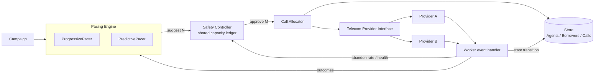
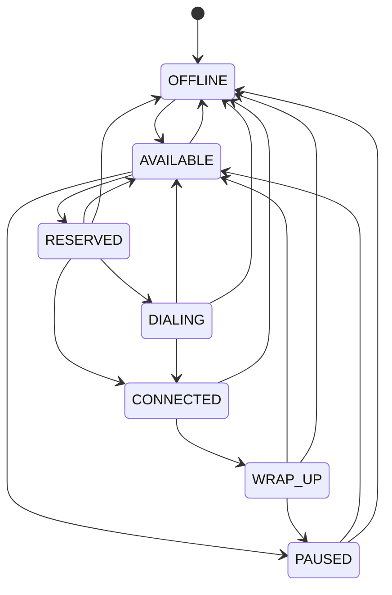
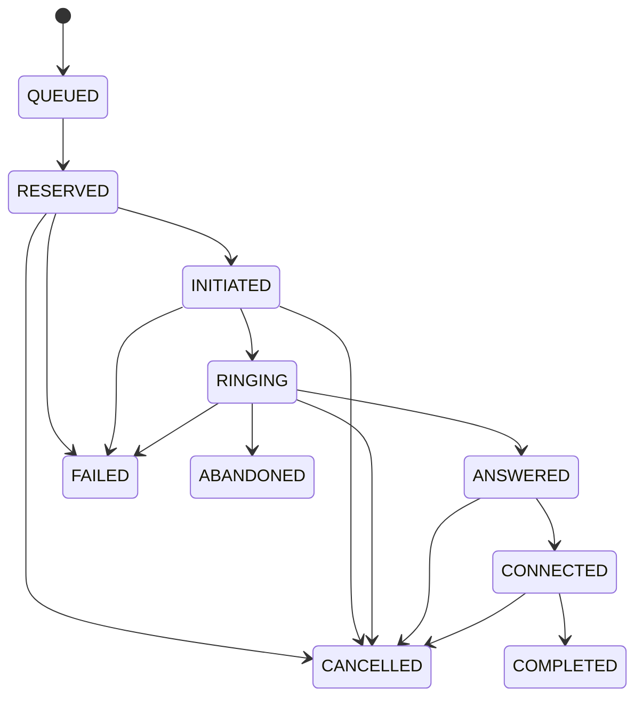

# SmartDialer — Architecture & Decisions

## 1. Stack choice

**Python 3 + standard library for the application, pytest for tests.**

The assignment is a prototype and explicitly says not to add technology merely to look impressive. An in-memory store makes concurrency and failure behaviour easy to demonstrate locally while keeping the API shaped like a real persistence layer.

| Question | Decision |
|---|---|
| What did you choose? | Python, threads, dataclasses/enums, in-memory Store. |
| Why? | Fast to run, easy to inspect, and sufficient for demonstrating the required state/concurrency logic. |
| What problem does it solve? | Keeps the important correctness rules small and testable. |
| What does it make harder? | It only proves cross-thread correctness inside one process; production needs a shared durable store and distributed leases. |

## 2. Architecture



The predictive pacer has no provider or allocator reference. It returns a `PacingSuggestion`; the worker must pass that suggestion through `SafetyController.evaluate()` before the allocator can call a provider.

### Agent state machine



### Call state machine



The implementation uses monotonic state ranks plus event IDs. Terminal states absorb all later events. In normal predictive operation, the answer-time safety gate prevents the call from entering `ANSWERED`/`CONNECTED` without an agent; `ABANDONED` remains a model/metric state for explicit compliance detection, not a normal path.

## 3. Concurrency and allocation

### Agent reservation

`Store.reserve_any_available_agent()` uses a per-agent lock and re-checks `AVAILABLE` while holding that lock. This makes the check-and-set atomic inside the prototype.

Production equivalents:

- Postgres: `SELECT ... FOR UPDATE SKIP LOCKED` or an atomic `UPDATE ... WHERE state='AVAILABLE'`.
- Redis: a lease using `SET NX PX` or a Lua compare-and-set operation.

The borrower queue has its own lock so two workers cannot reserve the same pending borrower.

### Predictive capacity ledger

A simple `available_agents <= approved` check is not sufficient with multiple workers: Worker 1 and Worker 2 could both read the same available count before either has placed a call.

The Safety Controller therefore owns a shared `_predictive_in_flight` counter protected by a lock:

```text
available agents = 10
Worker 1 asks for 10 -> approves 10, capacity ledger = 10
Worker 2 asks for 10 -> approves 0, capacity ledger = 10
```

When a predictive call reaches a terminal state, its token is released. If the allocator starts fewer calls than approved, unused tokens are also returned immediately.

This is still a prototype-level coordination mechanism; production moves the same invariant into a shared datastore/lease mechanism.

## 4. Deterministic safety boundary

Predictive pacing is intentionally allowed to be aggressive. Safety is not.

The controller applies, in order:

1. Shared agent-capacity limit.
2. Abandonment circuit breaker.
3. Progressive fallback when predictive mode is disabled.
4. Provider-health reduction.
5. Ramp-rate limiting.

The most important second line of defence is at provider-event time. Agent availability may change between a pacing decision and an `ANSWERED` event. Before an `ANSWERED` or `CONNECTED` predictive event is accepted, the worker atomically reserves an agent. If that reservation fails, it cancels the call and does not allow the call state to become connected without an agent.

Provider cancellation is best-effort in a real integration; the mock provider emits a terminal `CANCELLED` event, and any later provider events are absorbed because the call is already terminal.

This makes the safety rule deterministic at the dialer state-machine boundary even if the prediction is wrong or the provider is late.

## 5. Failure cases

### 5.1 Worker crash

Reservations have a 5-second lease. `reconcile_stale_reservations()` releases stale agent reservations and requeues stale borrowers. Calls that were initiated but never receive a provider event are separately protected by a call setup timeout.

A production version would persist the call/lease state and run the reconciliation sweep from an independent worker so recovery does not depend on the crashed worker returning.

### 5.2 Provider outage

Both mock providers expose a rolling health score. Provider B can also simulate a timeout where no event is delivered. Low provider health reduces new approvals. A call with no event eventually hits the setup watchdog, becomes `CANCELLED`, releases any reserved capacity, and returns the borrower to `PENDING` so a later safe attempt can occur.

Existing connected calls are not retroactively killed by a provider-health change.

### 5.3 Agent availability drops

Availability is read on each worker tick. If an agent disappears after a predictive approval but before an answer, the answer-time reservation fails and the call is cancelled rather than entering an unsafe connected state.

The response time in the demo is bounded by the worker tick (normally 0.4 seconds) for pacing changes; the final answer-time gate handles the smaller race between ticks.

### 5.4 Duplicate events

Exact duplicate event IDs are ignored. A different event ID carrying the same or a lower-ranked state is also a no-op. Provider B intentionally emits duplicate events to exercise this path.

### 5.5 Out-of-order events

State rank is monotonic. For example:

```text
RINGING -> CONNECTED -> ANSWERED
```

The late `ANSWERED` is ignored because the call is already at a higher rank, while the worker has already performed the required agent binding when `CONNECTED` was received.

Likewise:

```text
COMPLETED -> ANSWERED -> RINGING
```

leaves the call terminal at `COMPLETED`.

## 6. Predictive algorithm

`PredictivePacer` uses an intentionally simple, explainable ratio:

```text
raw_ratio = 1 / max(answer_rate, 0.02)
ratio = clamp(raw_ratio, 1.0, 4.0)
ratio *= safety_margin(0.85)
ratio *= max(0.25, provider_health)

target_concurrent = available_agents * ratio
suggested_count = clamp(
    round(target_concurrent - calls_in_flight),
    0,
    pending_borrowers
)
```

The pacer also tracks EWMA answer rate, average talk time and setup time. The suggestion includes the actual inputs and calculated target so a reviewer can answer:

> Why did the system suggest 17 calls instead of 10?

by reading the reasoning string rather than reverse-engineering a black box.

If observed abandonment rises above the configured threshold, the Safety Controller disables predictive mode for a cooldown and falls back to progressive behaviour.

## 7. Scenarios

The simulator implements the assignment's A/B/C/D structure. Talk times are scaled to 1.2 / 0.9 / 1.8 seconds so a laptop can run the scenarios quickly while preserving the relative 120 / 90 / 180 second relationships. Scenario D changes both answer rate and talk time during the run.

The report includes:

- agent utilization;
- calls initiated;
- calls connected;
- calls completed/failed/cancelled;
- abandoned calls;
- pacing suggestions and approvals;
- Safety Controller reasons.

## 8. Scale

| Scale | First bottleneck | Why | Production change |
|---|---|---|---|
| 100 agents | Nothing significant | Tiny in-memory scans. | Keep the simple model. |
| 1,000 agents | Linear agent/borrower scans | Every reservation may scan many records. | Maintain indexed available/pending sets or use database indexes + `SKIP LOCKED`. |
| 10,000 agents | Single-process CPU/GIL and in-memory state | Threads do not provide true multi-process scaling and all state is local. | Move state/leases to Postgres/Redis and run multiple workers. |
| 10,000+ agents / high event volume | Webhook/event ingestion | A single process handling every event becomes a bottleneck. | Queue provider events and consume them independently; keep state transitions idempotent. |

The important invariant does not change when scaling: agent allocation and predictive capacity must be coordinated through a shared source of truth.

## 9. Why not Kafka/Redis/Postgres in the prototype?

The assignment asks for a working prototype and explicitly says there is no correct infrastructure stack. Adding infrastructure would make deployment heavier without proving the core logic more clearly.

The current Store API intentionally mirrors the operations a durable backend would need: atomic reservation, versioned records, leases, idempotent state transitions and reconciliation. Replacing the Store is the next production step, not a redesign of the pacing/safety boundary.

## 10. Final answer

**How would I get as much utilization benefit of predictive dialing as possible while retaining deterministic safety characteristics of progressive dialing?**

I would make prediction an advisory layer only. The predictive engine continuously estimates the required dial rate from live answer rate, talk time, setup time and provider health, but it cannot call the provider. A shared Safety Controller owns the hard capacity boundary and can reduce, reject or fall back to progressive behaviour. Finally, every predictive answer is checked against a real, atomic agent reservation before the call is allowed into a connected state. That last check is essential because agent availability can change after the pacing decision. The result is a system that can be aggressive when conditions are good, but whose worst-case state transition remains deterministic and safe when predictions, workers or providers behave badly.
