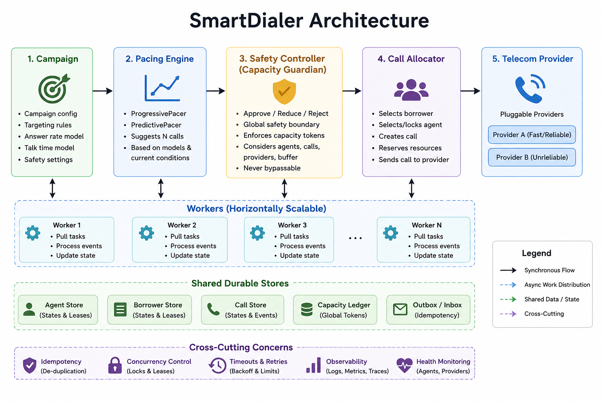
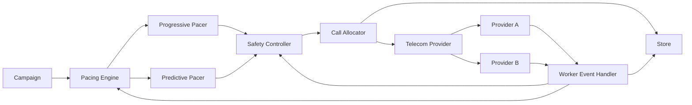
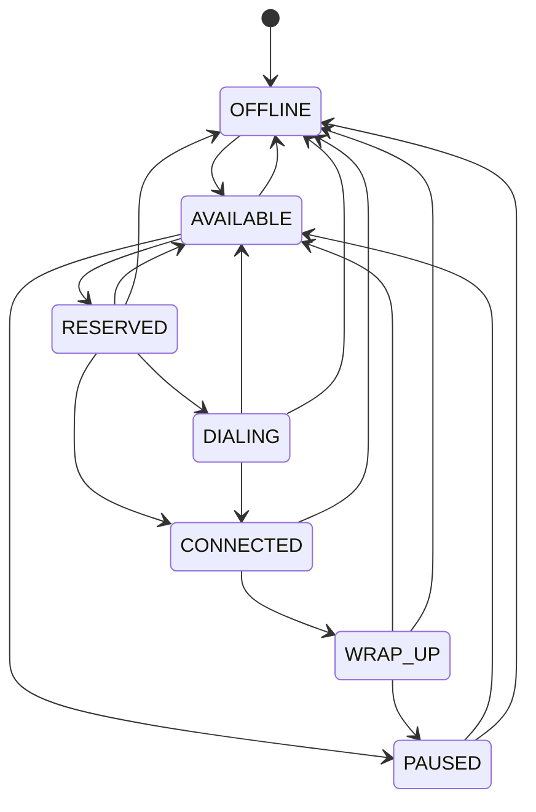
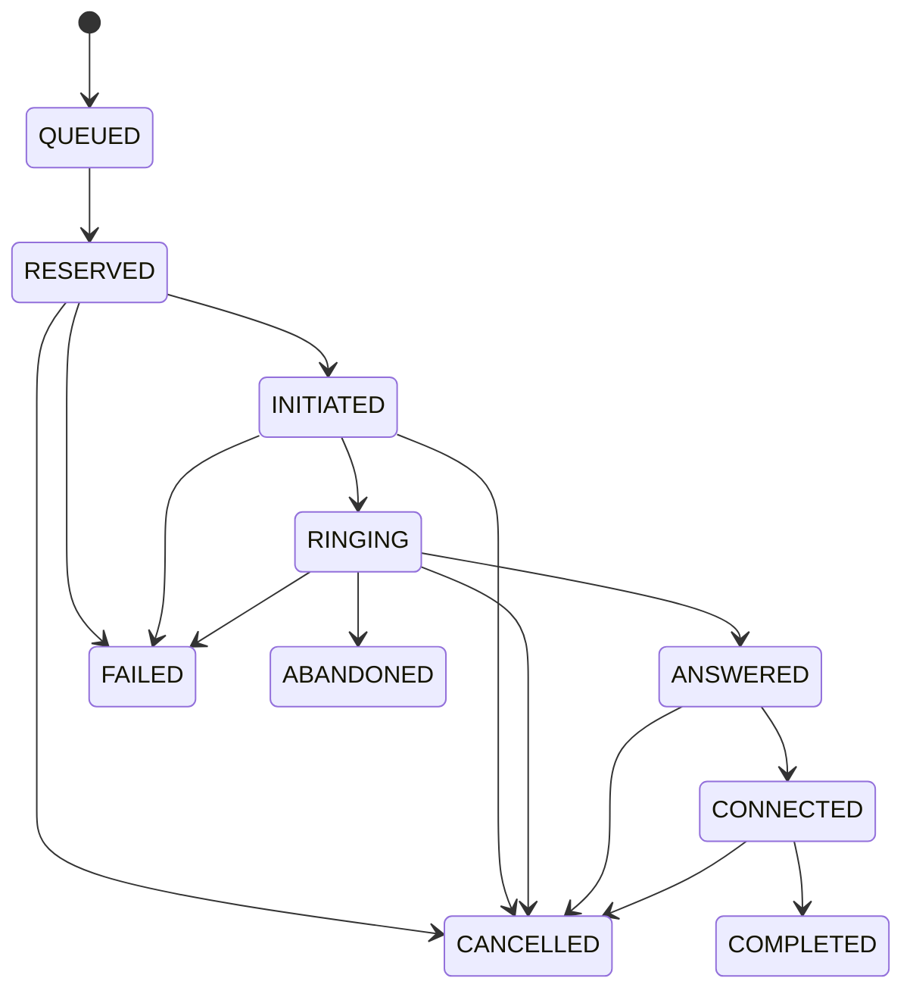

# SmartDialer — Architecture & Decisions

## 1. Stack choice

**Python 3 + standard library for the application, pytest for tests.**

The assignment is a prototype, so the implementation uses an in-memory store. This keeps the important concurrency, state-machine, pacing, safety, and failure-handling logic easy to run locally without requiring PostgreSQL, Redis, Kafka, or other infrastructure.

| Question | Decision |
|---|---|
| What did you choose? | Python, threads, dataclasses/enums, and an in-memory Store. |
| Why? | Easy to run locally and easy to inspect during a technical discussion. |
| What problem does it solve? | Demonstrates the core SmartDialer correctness rules without infrastructure overhead. |
| What does it make harder? | It proves coordination only inside one process; production needs shared durable state and distributed leases. |

---

## 2. Architecture

The repository also contains `architecture.png`, which is the primary diagram and does not depend on Mermaid rendering support.



### Mermaid version



The predictive pacer has no provider or allocator reference. It returns a pacing suggestion. The worker passes that suggestion through `SafetyController.evaluate()` before the allocator can place a call.

The Safety Controller is therefore a hard boundary:

```text
Campaign
   |
   v
Pacing Engine
   |
   | suggestion: N calls
   v
Safety Controller
   |
   | approved: M calls
   v
Call Allocator
   |
   v
Telecom Provider
```

---

## 3. Agent state machine



Equivalent lifecycle:

```text
OFFLINE
   |
   v
AVAILABLE <--------+
   |               |
   v               |
RESERVED           |
   |               |
   v               |
DIALING -----------+
   |
   v
CONNECTED
   |
   v
WRAP_UP
   |
   +----> AVAILABLE
   |
   +----> PAUSED
   |
   +----> OFFLINE
```

### Important invariant

Two workers must never reserve the same agent. `Store.reserve_any_available_agent()` uses a per-agent lock and re-checks the state while holding the lock.

For production, the same invariant should move to a shared datastore using an atomic update or a database row lock such as `SELECT ... FOR UPDATE SKIP LOCKED`.

---

## 4. Call state machine



The implementation uses two protections:

1. Provider event IDs make exact duplicate events idempotent.
2. Monotonic state ranks prevent lower-ranked late events from moving a call backwards.

For example:

```text
COMPLETED -> ANSWERED -> RINGING
```

leaves the call at `COMPLETED`.

Provider B can also produce:

```text
RINGING -> CONNECTED -> ANSWERED
```

The implementation treats `CONNECTED` as an answer-time safety point and performs agent binding there, so the later `ANSWERED` event cannot leave a connected call without an agent.

---

## 5. Concurrency and allocation

### Agent reservation

`Store.reserve_any_available_agent()`:

1. finds a candidate agent;
2. obtains that agent's lock;
3. re-checks that the state is still `AVAILABLE`;
4. changes it to `RESERVED` atomically inside the lock.

Therefore, if two workers see the same agent:

```text
Worker 1 ----\
              +---- agent lock ----> exactly one RESERVED
Worker 2 ----/
```

The borrower queue has its own lock so two workers cannot reserve the same pending borrower.

### Predictive capacity ledger

A simple `approved <= available_agents` check is not enough with multiple workers. Both workers could read the same available count before either starts a call.

The Safety Controller therefore maintains a shared predictive in-flight counter protected by a lock:

```text
10 available agents

Worker 1 requests 10
    -> approves 10
    -> reserved predictive capacity = 10

Worker 2 requests 10
    -> approves 0
```

When a predictive call reaches a terminal state, its capacity token is released. If fewer calls are actually started than were approved, unused tokens are returned immediately.

This is a prototype implementation. Production would put the same invariant into a shared durable store or distributed lease mechanism.

---

## 6. Deterministic safety boundary

Predictive pacing may be aggressive, but safety is deterministic.

The Safety Controller applies these checks:

1. shared predictive-capacity limit;
2. abandonment circuit breaker;
3. progressive fallback when predictive mode is disabled;
4. provider-health reduction;
5. ramp-rate limiting.

### Answer-time safety gate

Pacing happens before the provider answers, so an agent can disappear after a pacing decision. Therefore the final safety check happens when a predictive call reaches `ANSWERED` or `CONNECTED`.

```text
Predictive call answers
        |
        v
Try atomic agent reservation
        |
   +----+----+
   |         |
 success    failure
   |         |
   v         v
CONNECT   CANCEL
           |
           v
     never record
     unsafe connected call
```

If no agent can be reserved, the call is cancelled instead of being allowed into an unsafe connected state.

The mock providers model cancellation as a terminal event. A real telecom provider may make cancellation best-effort; later provider events are then ignored once the call is terminal.

---

## 7. Progressive dialing

Progressive mode reserves a real agent before placing an outbound call.

```text
AVAILABLE agent
      |
      v
RESERVED agent
      |
      v
DIALING
      |
      v
Provider
```

Therefore, with 50 available agents, progressive mode cannot create more than 50 agent-bound outbound calls at the same time.

If call setup fails, the agent is released and the borrower can be retried according to the retry policy.

If the agent disappears during setup, the reservation is released and the call is cancelled/fails safely.

---

## 8. Predictive pacing

`PredictivePacer` uses an explainable rule-based model rather than ML.

```text
raw_ratio = 1 / max(answer_rate, 0.02)
ratio = clamp(raw_ratio, 1.0, 4.0)
ratio *= safety_margin
ratio *= provider_health

target_concurrent = available_agents * ratio
suggested_count = clamp(
    round(target_concurrent - calls_in_flight),
    0,
    pending_borrowers
)
```

The pacer also tracks EWMA answer rate, average talk time, and setup time.

The suggestion includes the inputs and calculated target, so the reviewer can explain why the system suggested a particular number of calls.

If observed abandonment exceeds the configured threshold, the Safety Controller disables predictive dialing for a cooldown and falls back to progressive behaviour.

---

## 9. Telecom providers

### Provider A

- fast;
- reliable;
- low failure rate.

### Provider B

- slower;
- occasional failures/timeouts;
- duplicate events;
- out-of-order events.

The dialer depends only on the provider interface and does not depend on Provider A or Provider B implementation details.

Provider health is fed back into pacing and safety. A degraded provider therefore causes new dialing volume to decrease instead of allowing the predictive engine to continue at the same rate.

---

## 10. Failure handling

### 10.1 Worker crash

Agent and borrower reservations have a lease timestamp. `reconcile_stale_reservations()` releases stale reservations and makes stale borrowers available again.

Calls that were initiated but receive no provider event are separately protected by a call setup timeout.

In production, reconciliation should run in an independent worker against durable state so recovery does not depend on the crashed worker returning.

### 10.2 Provider outage

Provider health reduces new approvals. Existing connected calls are not retroactively killed because the provider's health score changed.

If a provider never sends an event, the call setup watchdog transitions the call to a safe terminal state, releases capacity, and makes the borrower eligible for a later retry.

### 10.3 Agent availability suddenly drops

The worker reads current availability on each pacing tick. More importantly, the answer-time safety gate handles the race between a pacing decision and the actual provider answer.

### 10.4 Duplicate events

Exact duplicate event IDs are ignored. A different event ID that carries a lower-ranked state is also ignored.

### 10.5 Out-of-order events

State transitions are monotonic. A later lower-ranked event cannot undo a completed or connected call.

For the Provider B case:

```text
RINGING -> CONNECTED -> ANSWERED
```

agent binding occurs at the connected safety point, and the late `ANSWERED` event is idempotent.

---

## 11. Retry and timeout handling

A failed or timed-out attempt follows this lifecycle:

```text
FAILED / CANCELLED / timeout
          |
          v
release agent/capacity
          |
          v
increment retry count
          |
     +----+----+
     |         |
 retries left  exhausted
     |         |
     v         v
PENDING       final failure
```

Retries are bounded by `max_retries` so a provider outage cannot create an infinite retry loop.

---

## 12. Simulation scenarios

The simulator implements the assignment's A/B/C/D scenarios.

| Scenario | Answer rate | Average talk time |
|---|---:|---:|
| A | 20% | 120 simulated seconds |
| B | 50% | 90 simulated seconds |
| C | 70% | 180 simulated seconds |
| D | changing | changing |

For fast local execution, the simulator scales those durations down while preserving their relative relationships.

Scenario D changes both answer rate and talk time during the run.

The simulation reports:

- agent utilization;
- calls initiated;
- calls connected;
- calls completed;
- calls failed/cancelled;
- abandoned calls;
- pacing suggestions and approvals;
- Safety Controller decisions.

Provider B can be selected to demonstrate latency, failures, duplicates, and out-of-order events.

---

## 13. Load and scale

The prototype load test exercises agent reservation at:

- 100 agents;
- 1,000 agents;
- 10,000 agents.

| Scale | First bottleneck | Why | Production change |
|---|---|---|---|
| 100 agents | None significant | Small in-memory scans. | Keep simple model. |
| 1,000 agents | Linear scans | Reservation may inspect many records. | Indexed available/pending sets or database indexes. |
| 10,000 agents | Single-process CPU and memory | All state is local and threads share one process. | Shared durable store plus multiple workers. |
| 10,000+ / high event volume | Event ingestion | A single process cannot safely absorb unlimited provider events. | Queue provider events and process them with idempotent consumers. |

The scalability mechanism should not weaken the core safety invariant: agent allocation and predictive capacity need a shared source of truth.

---

## 14. Why not Kafka, Redis, or PostgreSQL in the prototype?

The assignment explicitly says there is no required infrastructure stack. The important part is the reasoning and correctness of the SmartDialer behaviour.

Adding infrastructure would increase setup complexity without being necessary to demonstrate the core logic.

The Store interface is intentionally shaped around production operations such as:

- atomic reservation;
- leases;
- versioned state;
- idempotent event handling;
- reconciliation.

A production implementation can replace the in-memory Store with PostgreSQL/Redis without changing the main pacing/safety architecture.

---

## 15. Architecture decisions

| Decision | Benefit | Trade-off |
|---|---|---|
| Predictive pacer cannot call provider | Makes safety boundary enforceable | Adds an explicit control step |
| Safety Controller owns capacity | Prevents multiple workers from approving the same predictive capacity | Requires shared coordination |
| Answer-time agent reservation | Protects against availability changing after pacing | Can cancel a call after it has already answered |
| Monotonic call states | Handles duplicate/out-of-order events | Some provider events become no-ops |
| Lease-based recovery | Recovers from worker crashes | Requires reconciliation |
| Mock provider interface | Tests provider failure independently | Not a real telecom integration |
| In-memory Store | Easy local setup | Not durable or cross-process |

---

## 16. Final answer

**How would I build a SmartDialer that gets as much of the utilization benefit of predictive dialing as possible while retaining the deterministic safety characteristics of progressive dialing?**

I would make prediction an advisory layer only. The predictive engine estimates how many calls should be started using live answer rate, talk time, setup time, and provider health, but it cannot call the provider directly. A shared Safety Controller owns the hard capacity boundary and can approve, reduce, reject, or fall back to progressive behaviour. Finally, every predictive answer goes through an atomic agent-reservation check before the call is allowed into a connected state. This final check is essential because agent availability can change after the pacing decision. The result is aggressive dialing when conditions are favourable, while the safety boundary remains deterministic when predictions, workers, or providers behave badly.
